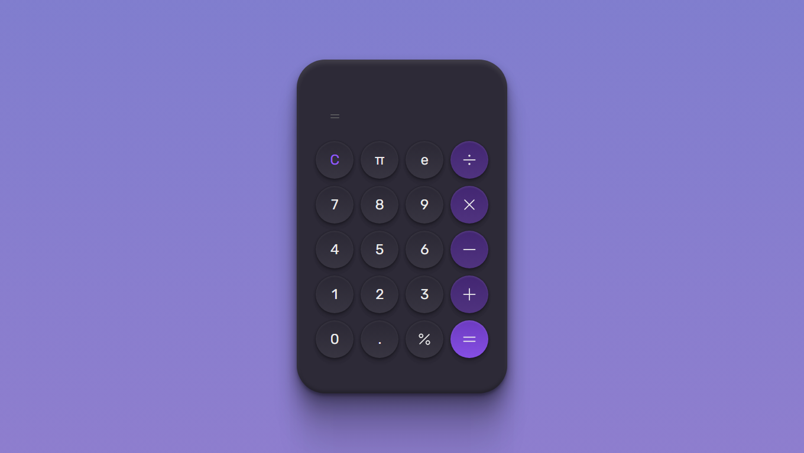

# Calculator


This is a simple calculator project implemented in JavaScript. The calculator provides basic arithmetic operations such as addition, subtraction, multiplication, and division. It also includes a percentage function.

## Usage

To use the calculator, simply click on the buttons on the calculator's interface. Here's a brief description of the buttons:

- Numbers (0-9): Input the numbers you want to calculate.
- . (dot): Used for decimal numbers.
- % (percentage): Calculates the percentage of the current input.
- = (equals): Calculates the result of the operation.

## Deploy

The calculator is deployed and can be accessed online. Click [here](https://afraniocaires.github.io/calculadora/) to use the calculator.

AfranioCaires: create a readme in english

GitHub Copilot: # Calculator
This is a calculator project made using JavaScript. The project was a challenge from #LetsCode by Rocketseat.

AfranioCaires: create a readme in english

GitHub Copilot: # Calculator

This is a simple calculator project implemented in JavaScript. The calculator provides basic arithmetic operations such as addition, subtraction, multiplication, and division. It also includes a percentage function.

## Usage

To use the calculator, simply click on the buttons on the calculator's interface. Here's a brief description of the buttons:

- Numbers (0-9): Input the numbers you want to calculate.
- . (dot): Used for decimal numbers.
- % (percentage): Calculates the percentage of the current input.
- = (equals): Calculates the result of the operation.

## Running the Project

To run the project, simply open the `index.html` file in your web browser.

## Contributing

Contributions are welcome. Please feel free to submit a pull request or open an issue.

## License

This project is licensed under the MIT License.

AfranioCaires: must include deploy section and link https://afraniocaires.github.io/calculadora/

GitHub Copilot: ## Deploy

The calculator is deployed and can be accessed online. Click [here](https://afraniocaires.github.io/calculadora/) to use the calculator.

Your updated README.md will look like this:

````markdown
# Calculator


This is a simple calculator project implemented in JavaScript. The calculator provides basic arithmetic operations such as addition, subtraction, multiplication, and division. It also includes a percentage function.

## Usage

To use the calculator, simply click on the buttons on the calculator's interface. Here's a brief description of the buttons:

- Numbers (0-9): Input the numbers you want to calculate.
- . (dot): Used for decimal numbers.
- % (percentage): Calculates the percentage of the current input.
- = (equals): Calculates the result of the operation.

## Deploy

The calculator is deployed and can be accessed online. Click [here](https://afraniocaires.github.io/calculadora/) to use the calculator.

## Running the Project

To run the project locally, follow these steps:

1. Clone the repository to your local machine using Git. Run the following command in your terminal:

```bash
git clone https://github.com/afraniocaires/calculadora.git
```
````

2. Navigate to the project directory:

```bash
cd calculadora
```

3. Open the `index.html` file in your web browser.

## Contributing

Contributions are welcome. Please feel free to submit a pull request or open an issue.

## License

This project is licensed under the MIT License.
